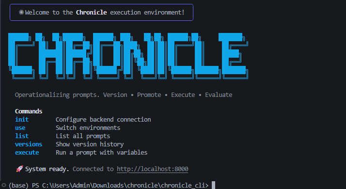

# PromptPilot & Chronicle 🚀

This repository contains the full source code for the "PromptPilot" major project.

## Structure

It is organized into two main parts:

### 1. Frontend (Root)
Built with **React, Vite, TailwindCSS, and Shadcn/UI**.
- **`src/`**: Contains the UI logic, components (`PromptEditor`, `VersionHistory`), and API client.
- **`public/`**: Static assets.
- **Configuration**: `vite.config.ts`, `tailwind.config.js`, `tsconfig.json`, `package.json` (Required for building and running the web app).

### 2. Backend (`/chronicle`)
Built with **Python, FastAPI, Gemini, and Groq**.
- Located in the `chronicle/` folder.
- Handles database (PostgreSQL), AI simulations, and Version Control logic.

## How to Run

1.  **Start Backend**:
    ```bash
    cd chronicle
    docker-compose up -d
    ```

2.  **Start Frontend**:
    ```bash
    # (From root)
    npm run dev
    ```

Open [http://localhost:5173](http://localhost:5173) to view the app.
# Chronicle

A prompt version control system with execution tracking, built on FastAPI and PostgreSQL.

Chronicle lets you create prompts, manage immutable versions with full history, promote versions to production, execute them against an LLM (Groq), and track every run with cost and latency data.
Record deletions are soft-deleted by default and can be restored from the Trash Bin. Items in the Trash Bin are automatically pruned after 20 days.

All API endpoints require an `X-API-Key` header. The GUI and docs are excluded from authentication.

---

## Architecture

```
chronicle/
├── main.py                  # FastAPI app, mounts GUI and API routers
├── config.py                # Settings via pydantic-settings (.env)
├── db.py                    # Async SQLAlchemy engine + session factory
├── version_control/         # Prompt & version CRUD, promotion, alias history
│   ├── models.py            #   Prompt, PromptVersion (SQLAlchemy)
│   ├── alias_history.py     #   AliasHistory model (promotion audit trail)
│   ├── schemas.py           #   Pydantic request/response models
│   └── routes.py            #   API endpoints for prompts, versions, promotion
├── execution/               # Prompt execution against LLM
│   ├── models.py            #   Run model (stores every execution)
│   ├── llm_service.py       #   Groq API wrapper
│   ├── variable_engine.py   #   {{variable}} injection with strict mode
│   ├── pricing.py           #   Model pricing table + cost calculation
│   ├── schemas.py           #   ExecuteRequest, ExecuteResponse, RunRead
│   └── routes.py            #   POST /execute/{prompt_key}
├── files/                   # Frontend (served at /gui)
│   ├── index.html
│   ├── style.css
│   └── app.js
├── alembic/                 # Database migrations
├── docs/                    # Documentation
│   ├── design-specification.md
│   ├── project-structure.md
│   ├── local-setup-guide.md
│   ├── phase1-implementation-status.md
│   └── testing-guide.md
└── test_chronicle_full.py   # 27 integration + unit tests
```

---

## API Reference

### Version Control — `/api/v1/version-control`

| Method | Endpoint | Description |
|--------|----------|-------------|
| POST | `/prompts` | Create a prompt (title, created_by; key is auto-generated if omitted) |
| GET | `/prompts` | List all prompts with latest version |
| GET | `/prompts/{id}` | Get prompt by ID with latest version |
| DELETE | `/prompts/{id}` | Delete prompt and all its versions |
| POST | `/prompts/{id}/promote` | Set production version (body: `{version_id}`) |
| GET | `/prompts/{id}/alias-history` | Get promotion audit trail |
| POST | `/versions` | Create immutable version (prompt_id, prompt_text, model_settings, created_by) |
| GET | `/versions/{prompt_id}/history` | List all versions for a prompt |
| GET | `/versions/latest/{prompt_id}` | Get latest version |

### Execution — `/api/v1`

| Method | Endpoint | Description |
|--------|----------|-------------|
| POST | `/execute/{prompt_key}` | Execute production version with variables |

The execute endpoint injects `{variables}` into `{{placeholders}}`, calls the LLM, records a `Run` row with status, latency, cost, and returns the response. The `X-PromptOps-Run-ID` header contains the run ID.

---

## Authentication

All API endpoints require an `X-API-Key` header matching the configured key. Excluded paths: `/gui/*`, `/health`, `/docs`, `/redoc`, `/openapi.json`.

```powershell
# Example authenticated request
Invoke-WebRequest -Uri http://localhost:8000/api/v1/version-control/prompts `
  -Headers @{"X-API-Key"="chronicle-dev-key"}
```

The GUI automatically includes the API key in all fetch calls.

---

## GUI Features

### Three-Theme System

The header contains a segmented control with three themes:

| Theme | Description |
|-------|-------------|
| **Dark** | Cold dark (blue accent, `#0B0E11` canvas) |
| **Light** | Clean white (blue accent, `#FFFFFF` canvas) |
| **Matte** | Warm off-black inspired by Claude.ai (amber-orange accent, `#1a1612` canvas) |

Matte is the default. Selection persists to `localStorage` under key `chronicle-theme`.

### Cost Estimation

- **Live token bar** — below the prompt editor textarea, shows estimated token count and per-call cost as you type
- **Estimate Cost button** — next to Execute in the execution panel, shows a detailed breakdown (tokens, input cost, model) for the production version before running it

---

## Introduced CLI Tool

Chronicle now includes a fully-featured Command Line Interface (CLI) to manage the prompt execution environment directly from your terminal.



### Key Capabilities

- **`init`**: Configure backend connections to your Chronicle instance.
- **`use`**: Switch between different environments easily.
- **`list`**: List all available prompts natively.
- **`versions`**: Show the version history for specific prompts.
- **`execute`**: Run a prompt with injected variables straight from the terminal.

---

## What We've Achieved

- **Version Control System**: Immutable prompt versions with full history, safe experimentation, and promotion workflows.
- **Execution Tracking**: Every LLM execution is recorded with cost and latency data natively linked to PromptOps traces.
- **GUI Interface**: A robust 3-column layout web interface featuring theme support and live cost/latency estimation.
- **CLI Tooling**: A dynamic terminal interface for developers to interact with Chronicle's API securely without context switching.
- **Reliable Backend Platform**: FastAPI and PostgreSQL powering a fast, strongly typed, and reliable PromptOps operational lifecycle.

---

## Key Design Decisions

- **Versions are immutable.** No update or delete on versions. Fix a bad version by creating a new one. All deletions are now soft-deletes with an auto-pruning job to prevent accidental hard deletion of alias history.
- **Promotion model.** Each prompt has a `production_version_id`. Promoting a version updates this pointer and logs the change to `AliasHistory`.
- **Pre-insert pending run.** The `Run` row is inserted with `status=pending` before the LLM call, then updated to `success` or `error` in a `try/finally`. No silent failures.
- **Cost tracking.** Per-execution cost is calculated from token usage and stored on the `Run` row. Unknown models get `cost_usd=None`.

---

## Supported Models

| Model | Input $/1K tokens | Output $/1K tokens |
|-------|-------------------|---------------------|
| llama-3.3-70b-versatile | 0.00059 | 0.00079 |
| llama3-70b-8192 | 0.00059 | 0.00079 |
| llama-3.1-8b-instant | 0.00005 | 0.00008 |
| mixtral-8x7b-32768 | 0.00024 | 0.00024 |
| gemma2-9b-it | 0.00020 | 0.00020 |

---

## Quick Start

### Prerequisites
- Python 3.11+
- PostgreSQL (local or Docker)

### Setup

```powershell
# Clone and enter project
cd chronicle

# Create and activate virtual environment
python -m venv .venv
.venv\Scripts\Activate.ps1

# Install dependencies
pip install -r requirements.txt

# Configure environment
# Edit .env — set DATABASE_URL and GROQ_API_KEY

# Run migrations
alembic upgrade head

# Start server
uvicorn main:app --reload
```

Open `http://localhost:8000/gui/` for the web UI, or `http://localhost:8000/docs` for Swagger.

### Docker

```bash
docker-compose up --build
```

---

## Testing

```powershell
# Run all 31 tests
.venv\Scripts\python.exe -m pytest test_chronicle_full.py -v

# Run a specific section
.venv\Scripts\python.exe -m pytest test_chronicle_full.py -v -k "TestExecutionBoundary"
```

Test coverage spans prompt CRUD, version control, promotion + alias history, execution boundary, run integrity, cost calculation, authentication (missing key, wrong key, correct key, auto-generated key), and the alias history endpoint.

See [docs/testing-guide.md](docs/testing-guide.md) for the full breakdown of what each test verifies and manual frontend testing instructions.

---

## Environment Variables

| Variable | Required | Default | Description |
|----------|----------|---------|-------------|
| `DATABASE_URL` | Yes | localhost | Async PostgreSQL connection string |
| `GROQ_API_KEY` | Yes | — | Groq API key for LLM calls |
| `API_KEY` | No | `chronicle-dev-key` | API key for authenticating requests |
| `DEFAULT_LLM_MODEL` | No | `llama-3.3-70b-versatile` | Default model for execution |
| `ENVIRONMENT` | No | `development` | Runtime environment |
| `LOG_LEVEL` | No | `INFO` | Logging level |

---

## Documentation

| Document | Description |
|----------|-------------|
| [Design Specification](docs/design-specification.md) | Full system design, schema diagrams, and phase planning |
| [Project Structure](docs/project-structure.md) | Module-by-module breakdown of the codebase |
| [Local Setup Guide](docs/local-setup-guide.md) | Step-by-step Windows local setup (no Docker) |
| [Phase 1 Status](docs/phase1-implementation-status.md) | Implementation checklist for all Phase-1 components |
| [Testing Guide](docs/testing-guide.md) | What to test, how to test, and expected results |
