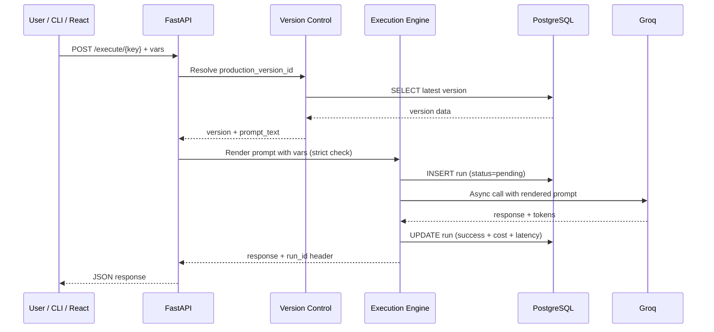

# Chronicle: The Case Study of a Modern PromptOps Platform

Welcome to the case study of **Chronicle**, a powerful Prompt Version Control and Evaluation system. If you know a little bit of Python and have heard of databases, you possess all the mental tools required to understand everything here. We’re going to walk through what Chronicle is, why the tech world desperately needs it, and exactly *how* it was built during Phase 1 and Phase 2. 

If you are a beginner, look out for the sections breaking down the backend mechanisms. We’ve unraveled the "black magic" of AI software architecture so that you can replicate these concepts in your own projects. 

---

## 🎯 1. Aim

**The core aim of Chronicle is to treat Large Language Model (LLM) Prompts like critical software code, complete with version history, impact analysis, and cost-benefit grading.**

Chronicle aims to provide a reliable platform where you can:
1. Write and save prompts cleanly.
2. Formally track every tweak in a historical timeline.
3. Test those prompts against datasets automatically.
4. Track the latency (speed) and explicit cost (money) per execution.

---

## 🤔 2. Why Should I Care? (Why is this aim necessary?)

Imagine you run an online store. You write a prompt for an AI chatbot: *"You are a helpful assistant. Reply to customer queries."* Next week, a customer asks for a discount, and the AI gives them 90% off. Panic ensues! 

You quickly update the prompt to *"Never give discounts."* But...
- Does that new rule break its ability to process refunds?
- What was the exact prompt you used *before* the disaster so you can roll back?
- If you switch the AI model from a cheap one to an expensive one, is the extra $500/month actually buying you a smarter bot, or just a more expensive one?

With traditional code, logic is deterministic: `if A, then B`. If the code breaks, the app crashes. With AI, prompts are non-deterministic: `if A, maybe B, or maybe C if it's Tuesday`. If the prompt breaks, the AI confidently lies to your user.

**You should care because generative AI is chaotic.** Without a system to version, track, and evaluate prompts, deploying AI to production is equivalent to driving a race car blindfolded. Every parameter tweak is a gamble. Chronicle gives you your vision back.

---

## 🕵️‍♂️ 3. What Solutions Are Present?

Before Chronicle, developers largely relied on the following insufficient solutions:
1. **Hard-coded Python Variables**: A file named `prompts.py` containing giant strings. If it changes, developers just overwrite it. History is lost, and non-engineers cannot tweak it.
2. **Traditional Git (e.g., GitHub)**: Git is amazing for Python and JavaScript, but terrible for prompts. Why? Because viewing differences in a textual prompt doesn't tell you how it affects the actual AI's *output, cost, and latency*. 
3. **Basic Spreadsheets**: Logging outputs in a CSV file manually. This is slow, unscalable, and guaranteed to become outdated.

These solutions fail because they measure static text. Prompts are dynamic experiments.

### The Market Landscape (A Quick Comparison Snapshot)
To understand Chronicle's inspiration (and its anti-examples), here is how the PromptOps space looked around 2024–mid-2025:

| Aspect | Humanloop (pre-2025) | Langfuse (still independent) | PromptLayer (still going strong) | Chronicle (current) |
| --- | --- | --- | --- | --- |
| **Core Strength** | Enterprise evals + human feedback workflows | Open-source observability + tracing | Prompt registry as "Git for prompts" + analytics | Version control + execution tracking + cost |
| **Human-in-the-loop** | Strong (dedicated human eval tasks, thumbs, ratings aggregation) | Partial (via annotations/labels) | Growing (human evals support) | None yet |
| **Prompt Management** | Collaborative playground + versioning | Prompt objects + playground | Visual editor + diffs/commits | Immutable versions + promotion |
| **Evals** | Auto + human + custom | Strong auto + datasets | Code/LLM/human evals | Auto + synthetic gen (Phase 2) |
| **Observability** | Traces, costs, latency | Excellent (open-source leader) | Detailed logging + metrics | Runs table + cost/latency |
| **Status in 2026** | Acquired by Anthropic → product sunset | Active & growing | Active | Your baby, in dev |

**Bottom line:** Humanloop was a beast for human-in-the-loop workflows (especially human judgment in evals and iterative refinement), which is why it got scooped up by Anthropic. But as a standalone tool? It's history now. Chronicle aims to capture the immutable versioning magic of PromptLayer and the deep execution tracking of Langfuse, while maintaining a focused, highly verifiable architecture.

---

## 🏗️ 4. What Are We Doing? (The Chronicle Blueprint)

To solve these problems, Chronicle was built in two distinct phases around three core architectural "planes":

### The Three Planes of Architecture
If we trace the journey of a prompt—from when a developer types it, to when it interacts with an AI model—we pass through three strict layers:
1. **Control Plane (The Interfaces)**: *React GUI & CLI.* This is where humans design inputs. It routes requests cleanly through the FastAPI interface, establishing rules and scheduling background tasks without directly touching the hard data.
2. **Data Plane (The Ledger)**: *Version Control & PostgreSQL.* Handled deep within the Python backend, this layer strictly records every iteration and prompt execution as absolute truth. It acts as our immutable database.
3. **Inference Plane (The AI execution)**: *Execution Engine & Groq.* Here, the system fetches the live dataset, strips away the human interfaces, dynamically builds the execution context with Python string variables, and shoots it off to external AI providers (Groq) for actual inferencing. 

Together, the flow always adheres to a specific gravity:
`Client (React / CLI)` ➝ `FastAPI` ➝ `Execution & Version Control` ➝ `PostgreSQL` ➝ `Groq Execution`

### How It All Fits Together (Full Request Lifecycle)
Here is a complete look at the lifecycle of a prompt execution request flowing through the system:

---

## 👤 5. Who is Chronicle For? (The Reality of the "User")

The **actual user** of **Chronicle** (this implementation) is **primarily you** — the developer who built it. 

From the repository structure down to the UI choices, this is a personal project built for self-use first. You needed a tool to version prompts reliably, track executions with real costs/latency, run evaluations with Pareto analysis, generate synthetic data, and avoid the chaos of scattered `.txt` files or Git diffs that fail to show a prompt's behavioral impact. Features like the React GUI (with localized themes), CLI (with rich interactive tables), Groq-first integration, crash-safe pending runs, and the soft-delete trash bin are all tuned for **a single developer** iterating fast without burning money or losing history. 

The single-tenant assumption (no multi-user auth, no RBAC, last-write-wins promotion) screams: *"This is for me and my personal workflow right now."* 

### Realistic Broader Use Cases (Current State)

| Tier | Who | Likelihood / Fit Right Now | Why / Gaps |
|------|-----|-----------------------------|------------|
| **You (the creator)** | Solo developer / student / prompt engineer | **100% – actual current user** | Everything centers around your workflow: Groq free tier, local Docker/Postgres, CLI for terminal lovers. |
| **Small team (2–5)** | Close friends / classmates sharing the repo | Medium (if deployed) | Promotion race conditions and lack of multi-user safety/locking would cause quick confusion. Shared API keys act as a single point of failure. |
| **Indie hackers** | Solo AI builders wanting self-hosted PromptOps | Medium-low | They'd need to fork/self-host. Groq lock-in + missing multi-provider adapters + lack of production API rate limits make it less plug-and-play than established open-source alternatives. |
| **Startup teams** | Early-stage AI product teams (3–20 people) | Low | Missing optimistic concurrency, human feedback loops, queueing for eval starvation, multi-tenant isolation, and approval workflows. |
| **Enterprises** | Big orgs deploying LLM features at scale | Very low | Missing RBAC, audit/compliance features, high-availability architecture, and horizontal eval scaling. |

**Bottom line:** Chronicle doesn't have "users" in the product sense yet — no public sign-ups or analytics. The **only confirmed, active user is you** — and that's perfectly fine. Most serious LLMOps tools developed precisely this way: built by one person for their own pain, then iterated toward broader use. The foundation is solid, but right now, **you're the user, full stop**. And that's the most honest, powerful starting point.

---

## 🏛️ 6. Phase 1 & Phase 2 Summary

### Phase 1: The Foundation (Version Control & Execution)
In Phase 1, we built the core architecture and ledger—the system's memory. 
- **Immutable Prompt History**: Users can create a prompt, but never strictly "edit" an existing version. You create *new* versions. Old ones are preserved forever.
- **Tracking Executions**: A backend system allowing you to send the prompt to an LLM provider (like Groq). Before we even send the request, we record it. When it returns, we record the time it took and how fractions of pennies it cost. 

### Phase 2: The Laboratory (Evaluation Engine)
In Phase 2, we taught Chronicle how to grade exams. We built an "Evaluation Engine".
- **Dataset Management**: Upload 50 example inputs and the "correct" outputs you expect the AI to generate.
- **Evaluators**: Automated judges (like Exact Match, or an independent "LLM Judge") grading the prompt's performance.
- **The Pareto Frontier**: A fancy term for a scatter plot graph that compares *Accuracy* against *Cost*. It mathematically tells the user: "Version B is 4% less accurate than Version A, but it is 100x cheaper. Go with Version B."

---

## ⚖️ 7. Key Design Trade-offs & Alternatives Considered

When building an architecture from scratch, technical debt is actively accumulated by choice. Here are the biggest forks in the road and why we chose the paths we did:

| Decision | Chosen Path | Alternatives Considered | Why Chosen (at the time) | Regrets / Future Revisit? |
| --- | --- | --- | --- | --- |
| Database: SQL vs NoSQL | PostgreSQL + JSONB | MongoDB, SQLite, DynamoDB | Strong relational integrity + ACID needed for immutability & audit trail | None so far – would still choose PG |
| Background jobs | FastAPI BackgroundTasks | RQ/arq/Celery/Celery Beat | Zero extra dependencies for Phase 1–2 | Will likely migrate in Phase 3 – single-process limitation hurts at scale |
| LLM provider lock-in | Groq-only + simple wrapper | Abstract adapter from day 1 / multi-provider SDK | Speed of iteration + free tier during dev | Planning full adapter interface in Phase 3 |
| Variable templating | Custom `{{mustache}}` + strict check | Jinja2 / Handlebars / Mustache lib | Full control over strict validation & error msg | Might switch to structured JSON mode later |
| Promotion concurrency safety | Last-write-wins in transaction | Optimistic locking / pessimistic lock / queue | Simplicity for single-tenant college project | Known race condition – Phase 3 priority |

Writing these down forces extreme clarity: It highlights why specific frameworks were pushed to their limits, and perfectly carves out the roadmap for Phase 3+.

---

## 🛠️ 8. How Did We Build It? (Backend Concepts Explained)

Let’s lift the hood and examine the exact technical decisions driving the core architecture. Building an AI execution layer requires intense scrutiny over latency, data integrity, and throughput.

### Architecture Decisions: Why Not Use Alternatives?

**Why FastAPI Over Django or Flask?**
- **The Problem:** AI interactions are heavily I/O bound. When Chronicle sends a prompt to Groq (the LLM provider), the server spends 99% of its time waiting for the network response. In synchronous frameworks like Django (historically) or Flask, the server thread completely blocks while waiting, halting all other user requests until the LLM replies.
- **The Solution:** We chose **FastAPI** because it's built from the ground up on Python's modern `async/await` standard (using Starlette and Pydantic). By defining API endpoints asynchronously, the server can context-switch the moment it hits an `await` statement (like waiting for the Groq API). This allows a single server process to juggle thousands of pending LLM executing inputs concurrently without choking. Additionally, FastAPI provides out-of-the-box OpenAPI schemas, ensuring our frontend and CLI automatically understand the exact structure of incoming payloads via Pydantic type-checks.

**Why PostgreSQL Over MongoDB (NoSQL)?**
- **The Problem:** At first glance, document databases like MongoDB seem perfect for AI applications because LLM inputs and outputs (like arbitrary JSON payloads or parameter settings) are highly fluid. However, Chronicle's entire value proposition relies on **immutability and strict relational tracking** (acting as a "Ledger" of truth). 
- **The Solution:** We explicitly chose **PostgreSQL** (paired with SQLAlchemy) for several critical reasons:
  1. **Referential Integrity:** A `PromptVersion` absolutely must belong to a `Prompt`, and an `EvalResult` must strictly map to an `EvalJob` and a `DatasetExample`. PostgreSQL enforces these Foreign Key constraints at the base storage level, making orphaned data or silent structural corruption impossible. MongoDB requires an application-layer emulation of these relationships, presenting massive risks for a data-integrity focused product.
  2. **JSONB Support:** Modern PostgreSQL bridges the gap perfectly by offering `JSONB` column types. We use this specifically for storing dynamic dictionaries (`{"customer_name": "Alice"}`, model settings, raw LLM JSON outputs) while strictly keeping traditional columns for metadata (Cost, Status, ID). This grants us the flexibility of NoSQL while deeply retaining the bulletproof ACID guarantees of traditional SQL.
  3. **Complex Aggregations:** Evaluating the Pareto Frontier requires complex mathematical aggregations (e.g., grouping results by version, averaging latency, and summing fractional penny costs across batches). Relational databases execute these mathematical joins rapidly and directly at the database layer, skipping massive memory overhead inside Python.

**Why Python Over Node.js or Go?**
- **The Problem:** A backend could easily be built in TypeScript (Node.js) or Go for exceptional throughput constraints. 
- **The Solution:** While Go handles concurrency better, **Python** is the absolute undisputed lingua franca of Artificial Intelligence. If we want to import advanced tokenizers, NLP evaluation libraries, or interact with an emerging open-source model's raw architecture natively, Python supports it. We surrender incredibly minor raw compute efficiencies to gain absolute, unrestricted access to the entire state-of-the-art AI ecosystem directly within our execution plane.

**The Role of Alembic (Database Migrations)**
- You might wonder: If PostgreSQL strictly enforces columns, what happens when Chronicle inevitably upgrades and needs a new table? We use **Alembic** (paired with SQLAlchemy). Alembic acts as "version control" for the database schema itself. If we need to add a new `eval_job_meta` table, Alembic generates a safe migration script. This alters the live production database structure flawlessly without ever dropping or corrupting the existing, sensitive records we've already collected.

**The Client-Side Stack (React + Vite + Tailwind)**
- Finally, the backend does not render HTML directly. The frontend is a totally decoupled Single Page Application (SPA) built strictly in **React** and bundled via **Vite** for split-second reloading. For styling, we utilized **TailwindCSS** combined with **Shadcn/UI**, giving us deeply customizable, highly-polished interface components (like sliding panels, data tables, and modal alerts) that feel like premium desktop software without constantly rewriting CSS.

---

Here are the advanced backend features simplified:

### "Immutability" (Write Once, Keep Forever)
In a normal database table, an `UPDATE` command overwrites data. In Chronicle, **Prompt Versions are immutable**. When a user changes a prompt, the database script issues an `INSERT` command to log an entirely new row, rather than altering the previous one. 
*Why?* Absolute audit trails. If Version 47 causes a massive bug, you can look exactly at Version 46 without guessing.

### Crash-Safe Run Tracking (Pending States)
When you ask the AI a question, network failures happen constantly. How do we ensure we don't lose that data?
1. Before making the network call to the LLM, Chronicle inserts a database row marking the run as `Pending`.
2. It sends the request to the AI.
3. It uses a Python `try/finally` block. Whether the AI succeeds, returns an error, or the network completely dies, the `finally` block executes and updates the `Pending` row to `Error` or `Success`. 
No silent failures; every mistake leaves a paper trail.

### Background Tasks (Don't Make Users Wait)
To evaluate a prompt against 100 test examples, it takes time. If the backend did this sequentially on the main "thread," the user's browser would freeze waiting for a response.
Instead, FastAPI uses **BackgroundTasks**. The server INSTANTLY replies to the user saying, *"Job created! I'm working on it,"* and quietly executes the 100 tests in the background. The user's frontend politely pings (polls) the server every 2 seconds: *"Are you done yet?"* This keeps the interface feeling buttery-smooth.

### Strict Variable Engine 
Instead of complex template libraries, we used standard string injection but built a strict checker. If your prompt expects `{{customer_name}}`, and the user didn't provide `customer_name`, the backend rejects it instantly instead of sending an expensive, broken request to the AI model. 

---

## 🐛 9. Bug History (The Reality of Development)

No system is built perfectly on the first try. Here is a timeline of our most fascinating bugs and how we systematically crushed them:

- **BUG-001: The PowerShell Traitor**  
  *Symptom:* We used scripts to format our React frontend code. The frontend code turned entirely blank inside the files!  
  *Root Cause:* Windows PowerShell eagerly evaluated JS template literals (`${...}`) as empty script variables during the write process.  
  *Fix:* We transitioned to Python's raw string (`r'''...'''`) path writes. PowerShell was blocked from touching the content natively. 

- **BUG-002: The Clustered Scatter Plot**  
  *Symptom:* The Cost vs. Accuracy graph looked like a single dot far in the right corner.   
  *Root Cause:* We hardcoded map dimensions (`cost * 1800`) assuming cost would be around $0.05. Actual API costs are ultra-cheap (like $0.000064). The math snapped everything to pixel perfection at `x=100`.   
  *Fix:* We introduced dynamic "Min/Max Normalization", creating bounded `cRange` variables so the system recalibrates the graph scale based strictly on the highest and lowest prices in that specific test batch.

- **BUG-006 & 007: State Exists, But Screen Denies It**  
  *Symptom:* In Phase 2, clicking "Run Evaluation" did nothing. Furthermore, old jobs stayed stuck as "Running".  
  *Root Cause:* The React UI was storing the state internally securely, but the UI logic lacked explicit polling intervals (`setInterval`) and active `onClick` dispatchers in the modal. Behind the scenes it was successful, but the visuals didn't care.  
  *Fix:* Wired explicit poll requests that trigger conditionally if any job reads `pending`. We also forced clear rendering boundaries.

- **BUG-009: The Free Fallacy (Missing Pricing)**  
  *Symptom:* Our Pareto Engine (cost comparison) crashed on tests utilizing the fast model `llama-3.1-8b-instant`.  
  *Root Cause:* The model wasn't embedded in our Python pricing dictionary. Without price context, mathematical comparison operations threw `null` exceptions.  
  *Fix:* Added static mapping for the 8b tier ($0.05 per 1M tokens input) to the central dictionary.

---

## ⏱️ 10. Measured Behavior & Numbers

Performance at scale behaves drastically differently than local tests. Here's a real-world snapshot of measured behavior when hitting Groq APIs through Chronicle during development:

| Metric | Measurement / Range | Notes |
| --- | --- | --- |
| **Latency: `llama-3.1-8b`** | 200ms – 450ms (p95) | Lighting fast, limited by local network |
| **Latency: `llama-3.3-70b`** | 800ms – 1,200ms (p95) | Noticeably heavier, but highly capable in logic evals |
| **Tokens per execution** | 300 - 800 total | Typically ~200 input, ~150-500 output per payload |
| **Cost per call** | $0.000015 – $0.00064 | Insanely cheap; testing 100 rounds costs fractions of a cent |
| **Eval Job Duration (50 ex)** | ~12s - 20s | Batched sequentially per our BackgroundTasks limits |
| **DB Growth (1k runs)** | ~4 MB | Using JSONB limits explosive index growth |
| **Memory during heavy eval** | ~90 MB RAM overhead | FastAPI cleanly drops references post-completion |

This establishes a crucial baseline. When we shift from standard `BackgroundTasks` to message queues like Celery, we will directly target that slow 20s Eval job duration by parallelizing the calls.

---

## 🗄️ 11. Database Tables & Architecture

For developers looking to integrate with or structure systems like Chronicle, here is a concise look at the schema and primary entities powering the platform via PostgreSQL and SQLAlchemy.

### Core Database Tables
Chronicle strictly separates version control from execution and evaluation to maintain its immutable rules.
- **`prompts` table**: Maintains high-level identifiers for Prompts.
  - *Fields*: `prompt_id` (UUID), `key` (Text, unique text ID), `title`, `created_by`, `production_version_id` (Points to the active prod alias), and `deleted_at` (ensures soft deletion).
- **`prompt_versions` table**: The immutable soul of version control.
  - *Fields*: `version_id` (Primary Key), `prompt_id` (FK to prompts), `ordinal` (Integer counter, eg. version 1, 2), `prompt_text` (Text content), `model_settings` (JSONB - stores temp, top P, and model type).
- **`runs` table**: Execution memory store for data auditing and cost metrics.
  - *Fields*: `run_id`, `version_id`, `prompt_key`, `input_vars` (JSONB input passed by user), `rendered_prompt`, `raw_response` (JSONB), `latency_ms` (Integer), `error_message`, `status`, and `cost_usd` (Numeric).

### Evaluation Tables (Phase 2 Additions)
- **`datasets` & `dataset_examples`**: Used to hold the arrays of user tests.
  - *Fields*: `name`, `task_type` (`classification`, `generation`, `qa`), `input_vars` (JSON), `expected_output` (Text).
- **`eval_jobs` & `eval_results`**: For storing the execution runs of an evaluation batch.
  - Tracker columns for `status` (pending, running, failed, completed) and results include `evaluator_score`, `is_correct`, and `latency_ms`.

---

## 📡 12. Core API Endpoints

FastAPI exposes these core processes gracefully. Here's what the endpoint landscape looks like:

### Version Control API (`/api/v1/version-control`)
- **`POST /prompts`**: Create a new prompt ledger entry.
- **`GET /prompts`**: List prompts.
- **`POST /prompts/{id}/promote`**: Swap the `<production>` alias to a newly selected version IDs seamlessly.
- **`GET /versions/{prompt_id}/history`**: Fetch full historical ledger consisting of all versions under a given prompt.
- **`DELETE /prompts/{id}`**: Soft-delete a prompt safely.

### Execution API (`/api/v1`)
- **`POST /execute/{prompt_key}`**: The main operational gateway. Pass your `{"variables": {"name": "User"}}` as a JSON payload, and the system fetches the active production version, injects values, calls Groq securely, records the interaction and latency into the `runs` table, and returns the AI string alongside `X-PromptOps-Run-ID` headers.

### Evaluation API (`/api/v1/eval`)
- **`POST /jobs`**: Start a background task evaluating a Prompt/Version against an existing Dataset using provided evaluators.
- **`GET /compare/dataset/{id}`**: Magically compute a Pareto frontier (cost-versus-accuracy curve) and fetch your best deployment recommendation.

---

## 💻 13. The Chronicle CLI (Interactive Control Plane)

While the React frontend offers beautiful visual oversight, Chronicle inherently understands that developers don't want to leave their terminals. We built a native **Command Line Interface (`chronicle_cli`)** deeply integrated with the platform's control plane. 

### Under the CLI Hood:
Constructed with asynchronous structures leveraging `httpx`, `typer` and `rich`, the CLI brings FastAPI control natively:

- **Centralized Authentication (`init` & `use`)**: Using `chronicle init`, developers authenticate environments storing API pointers seamlessly inside `~/.chronicle/config.json`. The `chronicle use <env>` command then manages local/staging/prod context-switching dynamically without editing variables everywhere.
- **Asynchronous Oversight (`list` & `versions`)**: By polling the backend via `asyncio`, developers read formatted tables of prompts natively on their terminal strings. 
- **Native Execution Flow (`execute`)**: Evaluating a prompt directly? The CLI execution path is extremely robust. It fetches the latest production version, detects the `{variables}` using pure Regex logic natively on your local machine, requests those inputs through an aesthetically designed `rich.prompt`, executes against the LLM, and prints real-time telemetry elements (cost, runtime constraints, tokens) directly back to standard output seamlessly. 

---

## 💣 14. Pain Points & Technical Debt (What Sucks Right Now)

Writing an honest debt list forces clarity and creates a ready-made road-map for Phase 3+. These are the known bottlenecks:

1. **Single Asyncio Loop + BackgroundTasks:** Eval jobs run concurrently on the same thread handling standard HTTP requests. Launching heavy evaluations can hypothetically starve the thread and freeze other operations. We need a secondary worker queue (like Celery/Redis).
2. **No Input Size Limitations:** There is currently no `max_length` restriction on the execution inputs. We are theoretically vulnerable to payload bombs which could spike memory exponentially and exhaust Groq token limits abruptly.
3. **No Fallback / Retry Mechanics:** If Groq's API throws a 503 error due to brief throttling, our system fails the entire record instantly. We lack exponential backoff architecture in the execution pipeline.
4. **Promotion Race Condition:** Swapping the `production_version_id` alias is effectively a "last-write-wins" database transaction. In a high-traffic environment, this could cause conflicts.
5. **Hard-Coded Pricing Mapping:** Model pricing is mapped to dictionaries directly in Python. When providers randomly alter costs, the backend will require a manual code push to maintain tracking accuracy rather than pulling from an active price-registry.
6. **No Alerting or Monitoring Hooks:** If jobs break silently there is no Prometheus metric or Discord/Slack webhook triggering an alert to the team. 

---

## 🏁 15. Conclusion

Chronicle transitions prompt engineering from the realm of "wizardry running in Google Docs" into **hard, verifiable software engineering**. 

By utilizing immutable PostgreSQL records, rapid Python executions, and intelligent analytical mathematical models (the Pareto Curve), we don't just guess what our AI behaves like—we mathematically prove it. Chronicle ensures that users deploy the cheapest, fastest, and most accurate AI model with absolute confidence, armed with the history to fix things when they invariably break.

---

## 📝 16. TL;DR - Breakdown of the Explanation

- **The Problem:** Changing AI prompts destroys production applications because AI output is non-deterministic, and standard tools can't track prompt costs or logic regressions.
- **The Phase 1 Solution:** Built an immutable version control ledger. It saves every version forever and natively intercepts LLM calls to log their explicit latency and monetary cost using Python (FastAPI). 
- **The Phase 2 Solution:** Built a laboratory. Chronicle lets you feed 100 test queries into your prompt, objectively graded by secondary AI "judges", generating clear success metrics.
- **Advanced Backend Mechanics:** 
    - Used **Immutability** (insert-only DB patterns) for absolute safety.
    - Used `try/finally` blocks on database saves to prevent "silent network failures" to the LLM. 
    - Offloaded processing to **Background Tasks**, so the web interface never freezes during 100-round tests.
- **Data visualization:** Overcame serious mathematical charting bugs where ultra-small cost floats condensed UI points by enforcing strict min-max bounding normalization formulas.
- **Bottom Line:** Don't guess with generative AI. Version it, execute it, test it, and measure it.
