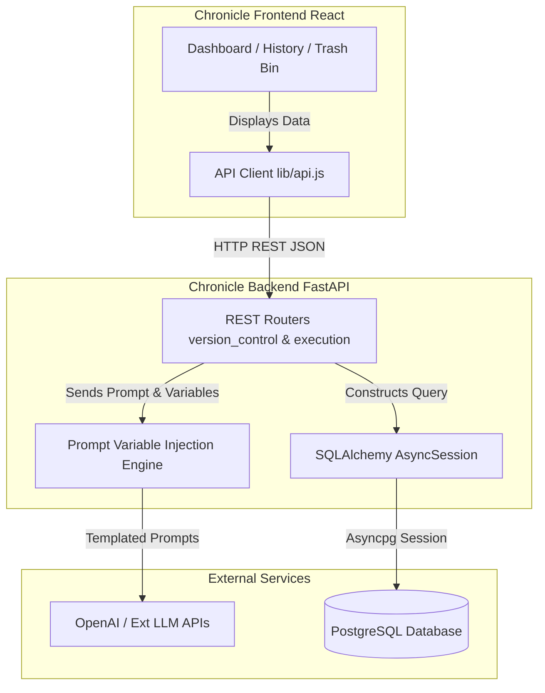
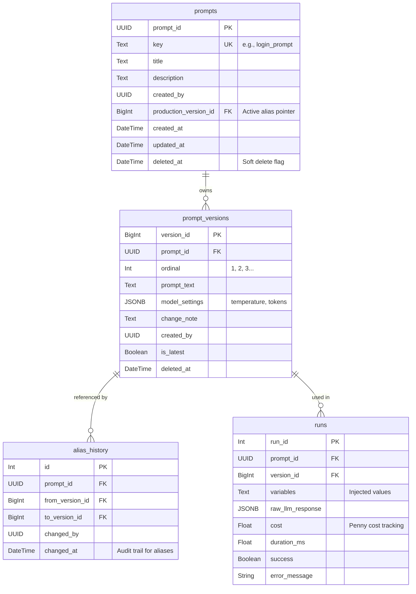
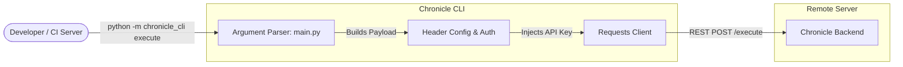

# Chronicle Architecture Overview


Below are architectural and entity-relationship (ER) diagrams built using Mermaid.js to help developers understand the Chronicle project's structure, components, and data flow.

## 1. Separate Component Diagrams

### 1.1 Fast API Backend & Frontend Architecture
This diagram outlines how the React dashboard communicates with the FastAPI layer, and subsequently how the backend routes traffic between the database and external LLM services.



### 1.2 Database Schema (Entity Relationship Diagram)
This captures the core normalized data structures enabling safe branching, aliasing, and historical auditing. Notice the soft-delete (`deleted_at`) pillars introduced to maintain data safety without throwing ORM cascading errors.



### 1.3 Chronicle CLI Architecture
The CLI is designed to wrap the raw HTTP REST requests into convenient local terminal strings. It relies on environment variables (`API_KEY`) to authenticate to the backend without hardcoding secrets.



---

## 2. Combined Architecture (The Big Picture)

This diagram shows how all clients (the human UI browser, and programmatic CI/CD pipelines using the CLI) converge onto the unified API gateway, interacting safely with the underlying databases and language models while enforcing immutability and tracking spend.

```mermaid
graph TD
    %% Actors
    Admin([Product Manager / Dev])
    System([CI/CD Auto-Runner])
    
    %% Client Layer
    subgraph Client Layer
        React[React Vite Dashboard]
        CLI[Python CLI Tool]
    end
    
    %% Application Layer
    subgraph API Layer FastAPI
        AuthMid[Auth & Telemetry Middleware]
        VC_API[/version_control/ Router]
        Exec_API[/execute/ Router]
        
        Engine[Variable Injection Engine]
        CostCalc[Token/Cost Calculator]
    end
    
    %% Data Layer
    subgraph Data Layer
        ORM[SQLAlchemy Core / ORM]
        Postgres[(PostgreSQL \n Prompts & Runs)]
    end
    
    %% External Integration
    subgraph External
        LLMProvider[OpenAI HTTP API]
    end

    %% Connections
    Admin -->|Manages UI| React
    System -->|Runs cronjobs| CLI
    Admin -->|Tests Prompts| CLI
    
    React -->|HTTP Auth Header| AuthMid
    CLI -->|HTTP Auth Header| AuthMid
    
    AuthMid --> VC_API
    AuthMid --> Exec_API
    
    VC_API --> ORM
    
    Exec_API --> Engine
    Engine -->|Builds pure string| LLMProvider
    LLMProvider -->|Raw Response| Engine
    Engine --> CostCalc
    CostCalc --> ORM
    
    ORM -->|Safe CRUD, Soft Deletes| Postgres
```
